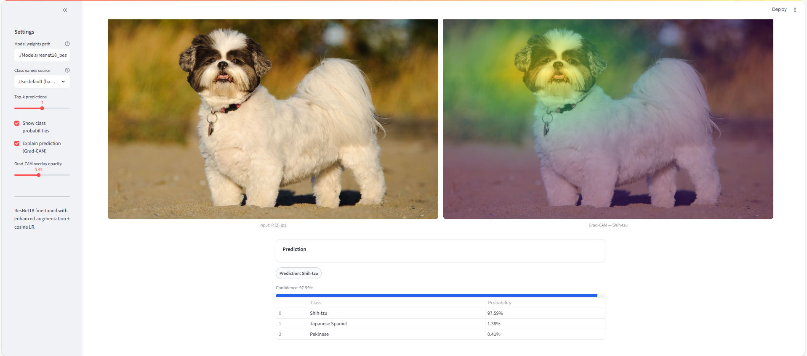

# Dog Breed Classification (ResNet18)

  
  
  
  
  

This project focuses on **image classification of dog breeds** using a **fine-tuned ResNet18** trained on 15 small dog breeds.  
It compares a baseline with moderate augmentation against an **enhanced augmentation strategy with cosine learning-rate scheduling**, which provided better generalization and robustness.  

- End-to-end **Computer Vision pipeline**: preprocessing → training → evaluation  
- **Model comparison** (baseline vs enhanced augmentation)  
- Final model deployed with a **Streamlit app**  
- Supports **Grad-CAM visualization** to explain model predictions  

---

## Streamlit Interface

Here is a preview of the application interface:



You can run the app locally (instructions below) to test dog breed predictions and Grad-CAM

You can access the live application [here](https://twittersentimentanalysis-cfhbucvitpghzvnwxt38vi.streamlit.app/).


---

## Project Structure

- `dog_breed_classification.ipynb` – Full pipeline (EDA, preprocessing, training, evaluation)  
- `app.py` – Streamlit app for interactive dog breed classification + Grad-CAM  
- `requirements.txt` – Dependencies  
- `Models/resnet18_best_baseline_enhanced.pth` – Final trained weights  
- `Images/` - Images folder (train/test/validation)

---

## Supported Dog Breeds

This model is trained on **15 dog breeds** only. Predictions are **reliable only if the input image contains a single dog** belonging to one of these breeds:  

| | | |
|---|---|---|
| Blenheim Spaniel | Border Terrier | Chihuahua |    
| Japanese Spaniel | Lakeland Terrier | Maltese Dog |  
| Norfolk Terrier  | Pekinese | Sealyham Terrier |  
| Shih Tzu | Yorkshire Terrier | Cairn |  
| Papillon | Toy Terrier | Wire-haired Fox Terrier |  


**Note**: The model works for those dog breeds.

---

## How to Run Locally

### 1. Clone the repository

```bash
git clone https://github.com/nasser-chaouchi/dog_breed_classification.git
cd dog_breed_classification
```

### 2. Create and activate a virtual environment
```bash
python -m venv venv
source venv/bin/activate   
# On Windows: .\venv\Scripts\activate
```

### 3. Install dependencies
```bash
pip install -r requirements.txt
```

### 4. Run the Streamlit app

```bash
streamlit run app.py
```

## Model Performance

### Baseline (moderate augmentation)
- **Accuracy**: ~89%  
- **Macro F1-score**: ~0.89  

### Enhanced Augmentation + Cosine LR (Final Model)
- **Accuracy**: ~91%  
- **Macro F1-score**: ~0.91  
- Better generalization on challenging breeds (e.g., Chihuahua, Shih-Tzu, Papillon)  

---

## Explainability with Grad-CAM

The Streamlit app includes **Grad-CAM heatmaps** to highlight which regions of the image influenced the model’s prediction, providing transparency and interpretability.  

---

## Built With

- Python  
- PyTorch (ResNet18, Grad-CAM)  
- torchvision (transforms, pretrained weights)  
- pandas, numpy, matplotlib  
- Streamlit (interactive app)  

---

## Author

**Nasser Chaouchi**  
Machine Learning & Data Science  
[LinkedIn](https://www.linkedin.com/in/nasser-chaouchi/)  

---

## License

This project is licensed under the [MIT License](LICENSE).  


